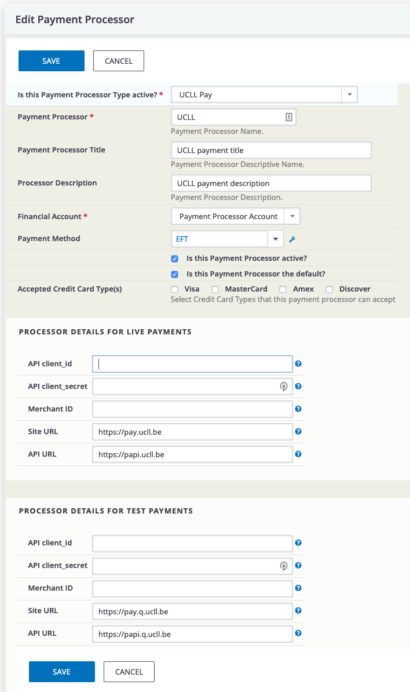

# be.ucll.ucllpayment

Adds payment option: UCLL Pay

The extension is licensed under [AGPL-3.0](LICENSE.txt).

## Requirements

* PHP v7.3+
* CiviCRM 5.24+

## Usage

- Enabling the extension which can be done from
```"Administer -> System Settings -> Manage CiviCRM Extensions".```

- Visit **Administer > System Settings > Payment Processors**
- Select the appropriate **Payment Processor Type**



## Links

- https://docs.civicrm.org/dev/en/latest/extensions/payment-processors/create
- https://github.com/circleinteractive/uk.co.circleinteractive.payment.worldpay
- https://github.com/cray146/org.civicrm.payment.ogone
- https://oauth.net/2/grant-types/client-credentials
- https://stackoverflow.com/questions/42670413/unsupported-media-type-in-postman

## Development

| Id | Status      |
|----|-------------|
| 1  | Completed   |
| 2  | Pending     |
| 3  | Cancelled   |
| 4  | Failed      |
| 5  | In Progress |
| 6  | Overdue     |

## Known Issues

(* FIXME *)


